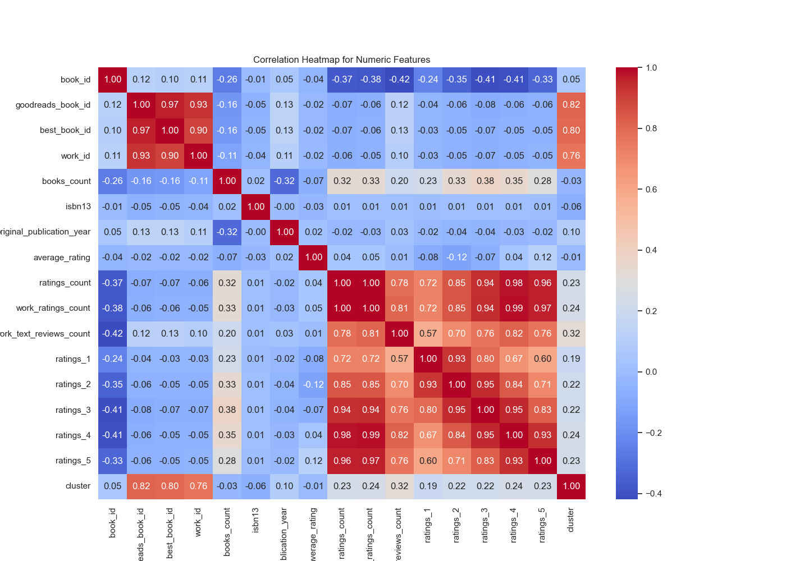
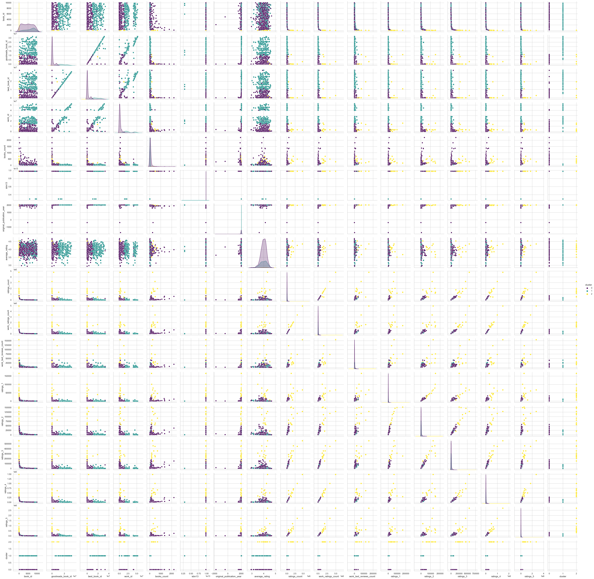
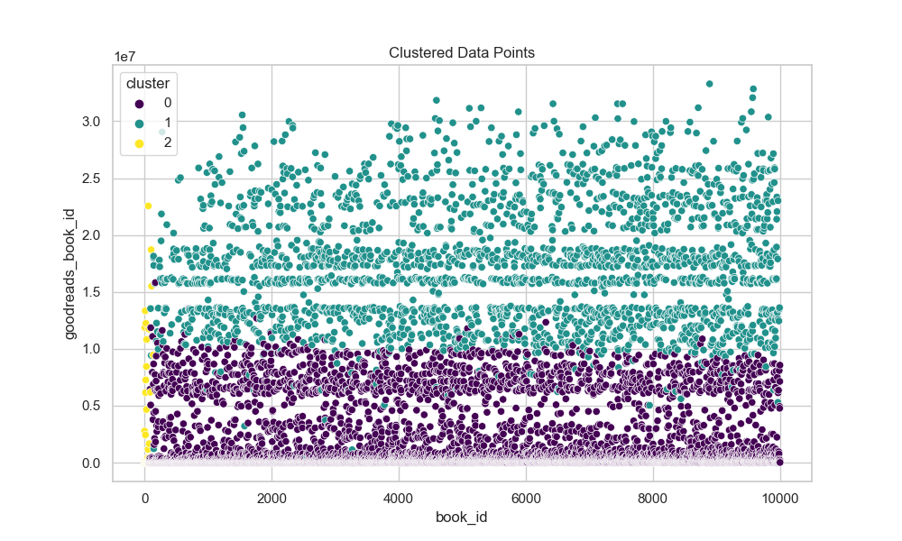

Based on the provided dataset characteristics and summary statistics for the happiness data, here are several insights and recommendations for further analysis:

### Summary of Insights:

1. **General Dataset Overview**:
   - The dataset consists of 2363 records across 12 numeric columns related to happiness metrics for various countries over multiple years (2005–2023).
   - The columns include metrics such as 'Life Ladder', 'Log GDP per capita', 'Social support', and measures of positive and negative affect, among others.

2. **Descriptive Statistics**: 
   - **Life Ladder**: The average value is approximately 5.48, with a standard deviation of about 1.12; this suggests that happiness levels (as measured by Life Ladder) vary significantly across countries.
   - **Log GDP per capita**: The mean is around 9.40, indicating a diverse economic landscape among the countries studied. There are some missing values (28 entries) in this column.
   - **Social Support**: Average value is about 0.81 with a relatively low standard deviation, indicating that social structures have a stable positive influence on happiness across the dataset.
   - Other metrics like 'Generosity' show a very low average (near zero), suggesting that potential positive actions towards others may not be widely present.
   - **Negative and Positive Affect**: The values for 'Negative affect' (mean ~0.27) and 'Positive affect' (mean ~0.65) indicate a general tendency towards positive emotional states among the surveyed populations.

3. **Correlation Insights**: 
   - **Strong Correlations**:
     - 'Life Ladder' shows strong positive correlations with 'Log GDP per capita' (0.78) and 'Social support' (0.72), indicating that wealth and social connections likely enhance happiness.
     - 'Healthy life expectancy at birth' also correlates well with 'Life Ladder' (0.71), emphasizing the importance of health in happiness.
   - **Negative Correlation**: 'Perceptions of corruption' shows a strong negative correlation with 'Life Ladder' (-0.43), suggesting that higher levels of perceived corruption relate to lower happiness.

4. **Outliers**: 
   - There are multiple outliers present in several columns, particularly 'Log GDP per capita', 'Social support', and 'Life Ladder', which could indicate unique cases worth investigating further.

5. **Missing Values**: 
   - Several fields have missing values (e.g., 'Healthy life expectancy at birth' = 63). This could impact analysis, especially if the missingness is not random.

### Suggestions for Further Analysis:

1. **Dealing with Missing Values**:
   - Investigate the underlying reasons for the missing values in specific columns. Consider imputation methods, or analyze whether missing data is correlated with certain variables.

2. **Outlier Analysis**:
   - Further investigate the outliers identified, especially in 'Log GDP per capita' and 'Social support'. Determine whether they represent unique, extreme cases or data entry errors.

3. **Yearly Trend Analysis**:
   - Analyze how happiness metrics have changed over time (yearly comparisons) to capture trends and cyclical patterns. This could involve time series analysis to understand stability or volatility.

4. **Impact of Economic and Social Factors**:
   - Conduct regression analyses to quantify the impact of various factors (like GDP, social support, and health) on happiness levels ('Life Ladder').
   - Explore interactions between different factors (e.g., how social support may amplify the impact of GDP on happiness).

5. **Cluster Analysis**:
   - Given the data includes a 'cluster' column, further analyze how these clusters are defined and the characteristics that differentiate them. Visualize cluster attributes more deeply and compare average happiness metrics across these clusters.

6. **Visualization Enhancements**:
   - Explore additional visualizations beyond heatmaps and pairplots, such as geographical distribution of 'Life Ladder' or happiness scores, potentially using maps to show regional patterns.

7. **Case Studies**:
   - Select a few countries from extreme ends of happiness scores and perform qualitative analysis to understand contextual factors that could explain their positions.

By focusing on these areas for further analysis, valuable insights can be derived that help understand the intricate relationships between socio-economic conditions and happiness across different countries and years.

### Data Visualizations
#### Correlation Heatmap

#### Pairplot

#### Cluster Scatter Plot
