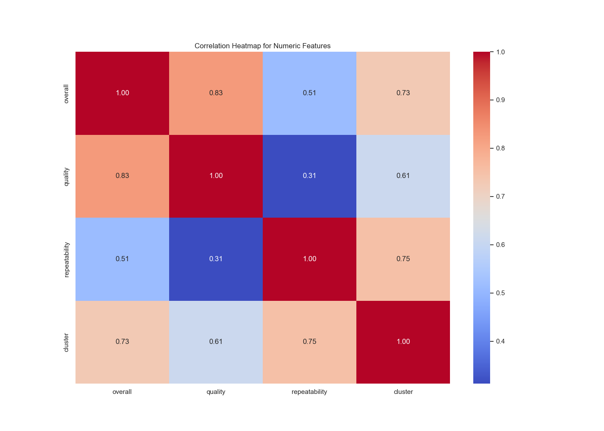
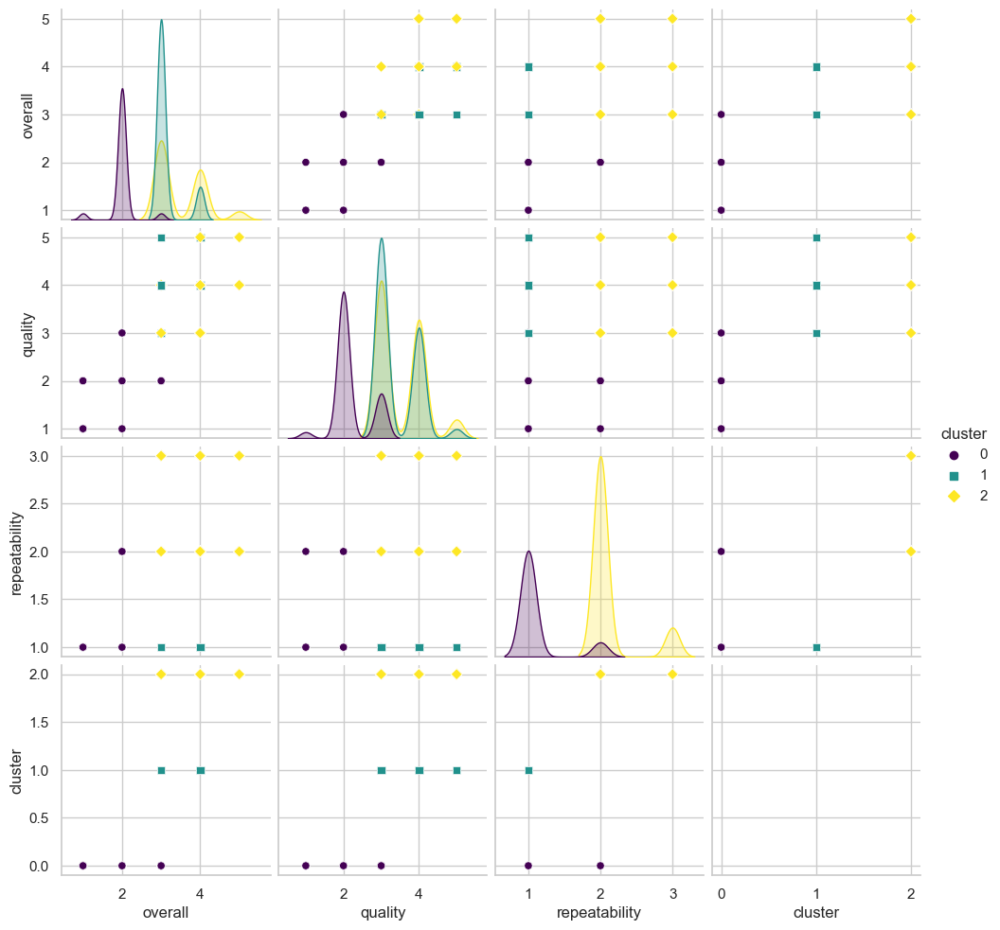
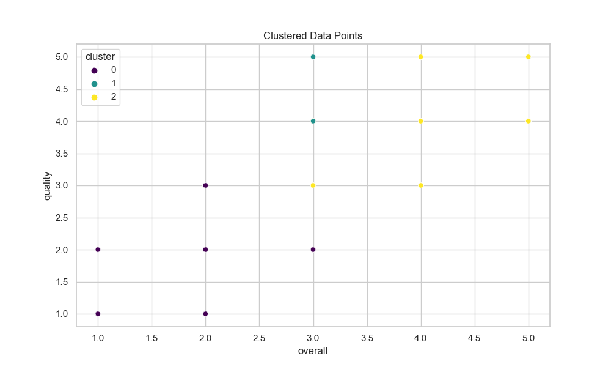

The provided dataset contains details about media items, including metrics like overall rating, quality, and repeatability. Let's delve into the insights we can extract from the data, potential suggestions for further analysis, and any notable observations.

### Summary of the Dataset

- **Total Entries:** 2652
- **Key Attributes:**
  - `date`: Contains some missing values (99 entries). It provides the timestamp of media items.
  - `language`: Contains 11 unique languages, with English being the predominant language (1306 entries).
  - `type`: The dataset types include 8 categories with 'movie' being the most frequent (2211 entries).
  - `title`: There are 2312 unique titles, indicating a diverse set of media.
  - `by`: Contributions from 1528 unique individuals, with Kiefer Sutherland being the most frequently noted (48 entries).
  - Rating metrics (`overall`, `quality`, `repeatability`):
    - **Overall Rating:** Mean is ~3.05; standard deviation of ~0.76, ranging from 1 to 5.
    - **Quality:** Mean is ~3.21; standard deviation of ~0.80.
    - **Repeatability:** Mean is ~1.49; standard deviation of ~0.60.
   
- **Correlation:**
  - Strong correlation between `overall` and `quality` (0.83).
  - Moderate correlation between `overall` and `repeatability` (0.51).

### Insights

1. **Dominance of English:** The majority of items being in English suggests that any trends or insights derived from the dataset might be heavily influenced by this language group.
   
2. **Type Distribution:** The predominance of movies indicates a focus area that may warrant specific marketing strategies or content planning.
   
3. **Ratings Analysis:**
   - The average `overall` and `quality` ratings hover around 3, suggesting that users may feel neutral to moderately satisfied with the media.
   - The relatively low average in `repeatability` indicates that media consumption may not be high-frequency; audiences may be inclined to watch content only once.

4. **Missing Values:** Significant missing values in the `date` and `by` attributes may hinder time series analyses and author-related insights.

### Suggestions for Further Analysis

1. **Time Series Analysis:**
   - Utilize the `date` attribute to analyze trends over time. This could provide insights into how ratings or types of media have evolved.
   - Convert the `date` column to a datetime format to facilitate this analysis.

2. **Language-Based Analysis:**
   - Investigate how ratings differ across languages. This could shine a light on cultural influences on media consumption.
   - Assess which languages correlate most with top-rated media.

3. **Type Segmentation:**
   - Further segmenting the analysis based on `type` could yield insights on which types consistently receive higher ratings.
   - Explore user preferences across different media types (movies, shows, etc.).

4. **Analysis on Contributors:**
   - Perform an analysis based on the `by` column to understand which contributors (e.g., directors, actors) are associated with higher ratings.
   - Explore author collaborations and the impact on media reception.

5. **Missing Value Strategy:**
   - Explore techniques to handle missing `date` and `by` values, such as imputing or excluding certain analyses based on data completeness.

6. **Clustering and Classification:**
   - Leverage clustering results and try to uncover distinct groups of media. Analyze what characteristics are prevalent in each cluster.
   - Develop a predictive model to forecast ratings based on available attributes using classification techniques.

7. **Outlier Analysis:**
   - Although no outliers are noted in the metrics provided, further statistical methods could be employed to verify this, which could uncover unique media that didn't fit standard rating patterns.

### Visualization Recommendations
- **Trend Analysis Visuals:** Generate time-series graphs for ratings over time.
- **Heatmap Analysis:** Use the provided heatmap to analyze further correlations beyond what's been stated and to visualize relationships clearly.
- **Boxplots:** To explore and visualize distributions of `overall`, `quality`, and `repeatability` based on `type` or `language`.

By pursuing these analyses and insights more deeply, you can better understand user engagement and satisfaction with the media content in your dataset, potentially guiding content strategies and marketing efforts.

### Data Visualizations
#### Correlation Heatmap

#### Pairplot

#### Cluster Scatter Plot
